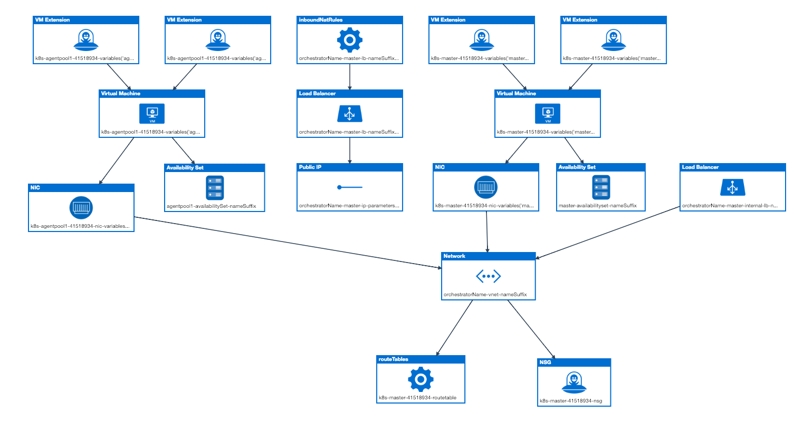

# simplek8s
Terraform based simplistic kubernetes deployment on Azure

This is an attempt to deploy a simple unmanaged kubernetes cluster via terraform. This is the **Hard** way of deploying kubernetes.

In a world where tools such as AKS Engine, KOPS etc. already exist, one might question why even embark on this journey. There is no single answer with me. I've contributed to these tools and I use them on day to day basis to manage AKS Infrastructure at Microsoft. 

The story of kubernetes deployment at today is already overdone. People have moved on to figure out Day2 challenges of the managing a kubernetes cluster. 

I am coming back with a quest to see if what we already have can be even more simpler. 

ACS Engine tries to create a giant ARM Template which deploys more than 50 different azure resources(count grows exponentially with number of agents) such as VMs/loadbalancers/publicIPs/virtual networks and so on. Then there's actual deployment of kubernetes components via custom script extensions and cloud-init. As the template has grown overtime, its no longer idempotent. If the template deployment fails, users have little choice but to delete everything and start from scratch.

This is my humble attempt to decouple deployment of Azure resources from the actual provisioning/installation of kubernetes components on the infrastructure. By using terraform to deploy azure resources, I am trying to leverage terraform's capability to reconcile when errors happen and detect drift over time. 

Here's a blueprint of a kubernetes cluster deployed via ACS Engine:

My first goal is to deploy the above resources via terraform on azure.
